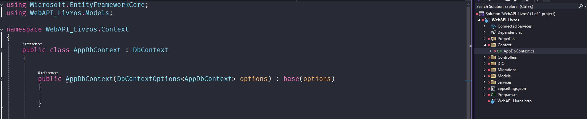
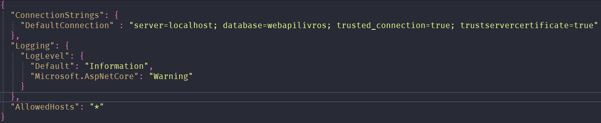
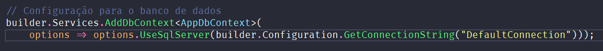
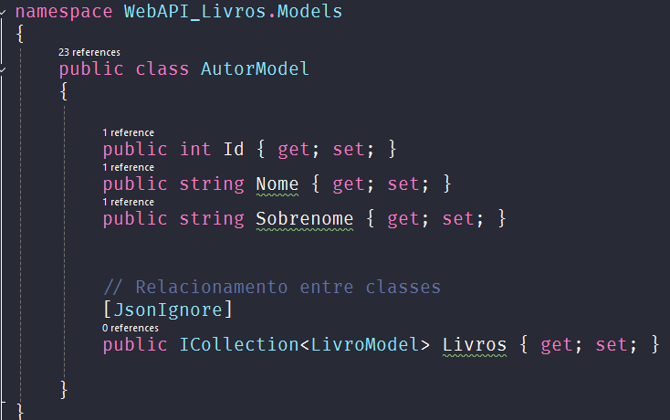
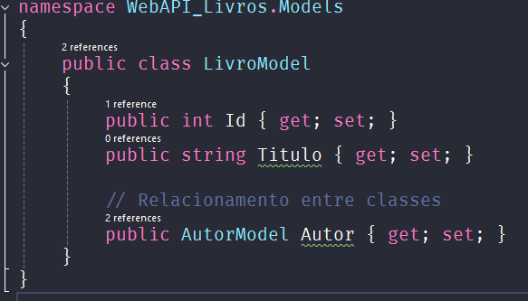

# Estudos C# .NET

Ferramentas obrigatórias utilizadas para estudos:
- [Visual Studio 2022](https://visualstudio.microsoft.com/pt-br/vs/community/)
- [SqlServer](https://www.microsoft.com/pt-br/sql-server/sql-server-downloads)

Para criar uma aplicação C#/.NET o modelo de projeto escolhido é o **API Web do ASP.NET Core**.
- imagem

Ao criar uma aplicação em C#/.NET, a primeira coisa a se fazer é adicionar as dependências necessárias para fazer a conexão com o banco de dados. Abaixo são os seguintes pacotes utilizados:

- **Microsoft.EntityFrameworkCore**: Pacote responsável por fazer a abstração de uma linguagem de programação para o sql, ou seja, ORM (Object-Relational-Mapper).

- **Microsoft.EntityFrameworkCore.SqlServer**: Pacote responsável pelo banco de dados que será conectado que nesse caso foi o SqlServer.

- **Microsoft.EntityFrameworkCore.Design**: Responsável por permitir executar as migrations em linha de comando através do terminal.

- **Microsoft.EntityFrameworkCore.Tools**: Pacote responsável pelo funcionamento das outras dependências adicionadas através do EntityFrameworkCore.

## CONFIGURAÇÕES DE BANCO DE DADOS

A conexão do banco de dados com a linguagem se da através de uma classe criada por nós que normalmente recebe o nome de **AppDbContext** ou o nome da aplicação ou até mesmo escolhido pelo desenvolvedor seguido de DbContext, que extende uma classe já existente que vem do pacote EntityFramewokCore. E por convenção de boas práticas, cria-se um diretório para armazenar essa classe criada, com o nome de **DATA** ou **Context** que são as nomenclaturas referidas á ligação com o banco de dados.

### Construção da classe:

- AppDbContext : DbContext - Ao extender a classe DbContext, a classe AppDbContext herdará as configurações responsáveis por lidar com a comunicação com o banco de dados.

- O construtor recebe como parâmetro Interface **DbContextOptions** que recebe como atributo a classe AppDbContext, permitindo que a classe de atributo utilize os contextos responsáveis para lidar com o banco de dados.

### String de conexão:

Para configurar a conexão com o banco é necessário configurar o caminho no arquivo **appsettings.json**. Adicionar o atributo **ConnectionStrings** e passar os seguintes valores:

- "DefaultConnection" - Nome que será utilizado pela linguagem para localizar a string de conexão. Pode ser dado qualquer nome, visto que podemos ter mais de uma conexão com diferentes bancos de dados.

    - server: Local de hospedagem do banco de dados.
    - database: Nome do banco de dados.
    - trusted_connection: Verificação de autenticação do windows.
    - trustservercertificate: Verificação de autenticação do windows.

Esses dois últimos podem ser alterado, pois em um ambiente de produção é utilizado um formato onde se informa o User id e Password.

Após configurar essa parte, é preciso disponinilizar a conexão como um serviço para ser utilizado pela aplicação através do arquivo Program.cs:

Com esses passos realizados, a aplicação está pronta para ser utilizado com o banco de dados!

## MODELAGEM E RELACIONAMENTO DE ENTIDADES

Parecido com o Spring o .NET utiliza o padrão MVC como arquitetura de aplicação idetificando em repositórios as entidades, services, dtos e afins, com mudança apenas nos repositories.

### Entidades / Models:

As entidades ficam no diretório chamado Models e sua nomenclatura segue com o nome da classe e sua responsabilidade, ex: **AutorModel**. E é definida com seus atributos principais, esses que serão preenchidos ao instanciar um novo objeto e também com os que serão relacionados posteriormente.

- **AutorModel**:

    - 

- **LivroModel**:

    - 

### Relacionamentos:

De acordo com a arquitetura definida em diagramas, sejam eles ER o de CLASSE, utilizando de exemplo a classes acima o relacionamento foi o seguinte, 1 autor pode ter vários livros e 1 livro pode ter apenas um autor:

- **Autor - 1:N**:

Como o autor poder ter vários livros utiliza-se a Interface **ICollection**, que vai indicar que ele pode receber oma coleção de livros.

- **Livro - 1:1**:

Já o livro pode receber apenas 1 autor, então é instânciado apenas a entidade como tipo de atributo.